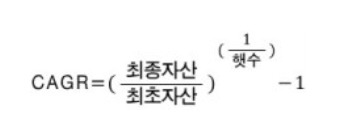
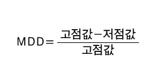
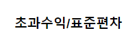

백테스트 결과

### 일평균수익률 [G]

### 누적수익률 [G]


### CAGR [G]
**Compound Annual Growth Rate**의 약자이며, 통상적으로 **연평균 수익률** 의미한다.

수익률은 연마다 곱하기로 계산되기 때문에 우리가 평소에 하는 평균내는 방법이랑 조금 다르다.
2년동안 21%의 수익이 났다면 연평균 수익률은 10.5%가 아니라 10%이다.(`1.10 x 1.10 = 1.21`)

평균이기 때문에 CAGR이 양의 값이여도 실제로 중간에 음의 수익률을 기록한 기간도 존재할 수 있다.
CAGR은 높을 수록 좋지만, CAGR이 20~30%를 넘어간다면 뭔가 의심을 해봐야한다.
그 자산은 아마 변동성, 즉 오르내림이 매우 심한 자산일 것이다.

```python
lstm_book_df['lstm_ret'] = lstm_book_df['next_rtn'] * lstm_book_df['position'].shift(1)
lstm_book_df['lstm_cumret'] = (lstm_book_df['lstm_ret'] + 1).cumprod()
CAGR = lstm_book_df.loc[lstm_book_df.index[-1], 'lstm_cumret'] ** (252. / len(lstm_book_df.index)) - 1
```



### MDD [G]
MDD는 **Maximum Drawdown**의 약자이며, **최대낙폭**이라고 한다.

수익률 곡선이 최고점을 찍고 최대 몇%까지 손해보았는지에 대한 지표이다.
예를 들어 MDD가 60% 라면 재산이 최대 -60%도 찍어본 적이 있다는 의미이다 (MDD로만은 회복 여부에 대해서는 알 수 없다).
따라서 MDD는 낮을 수록 좋다.

```python
historical_max = lstm_book_df['Close'].cummax()
daily_drawdown = lstm_book_df['Close'] / historical_max - 1.0
historical_dd = daily_drawdown.cummin()
MDD = historical_dd.min()
```



### Sharpe
수익률은 높으면서 변동성은 낮기를 원한다.
Sharpe 지수는 수익률은 높은 것에 비해 변동성은 낮은 자산을 찾고자 만들어진 지표다.


수익률을 변동성(수익률의 표준편차)으로 나눈 것이다.
분자에 수익률, 분모에 변동성이 들어가니 자연스럽게 샤프지수가 커지면 커질 수록 안정적인 자산이라고 할 수 있다.

```python
lstm_book_df['lstm_ret'] = lstm_book_df['next_rtn'] * lstm_book_df['position'].shift(1)
Sharpe = np.mean(lstm_book_df['lstm_ret']) / np.std(lstm_book_df['lstm_ret']) * np.sqrt(252.)
```




### VOL
변동성
```python
lstm_book_df['lstm_ret'] = lstm_book_df['next_rtn'] * lstm_book_df['position'].shift(1)
VOL = np.std(lstm_book_df['lstm_ret']) * np.sqrt(252.)
```

